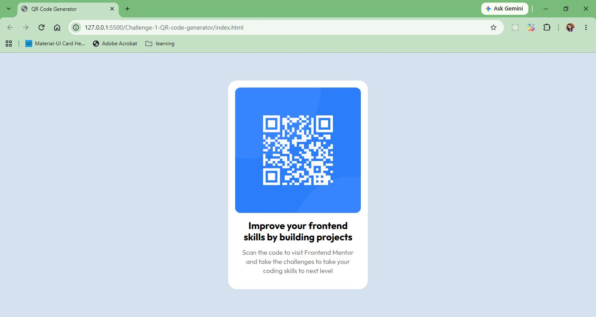

# Frontend Mentor - QR Code Component

This is my solution to the [QR Code Component challenge](https://www.frontendmentor.io/challenges/qr-code-component-iux_sIO_H).

## Overview

### The challenge

The goal was to build a QR code component as closely as possible to the provided design.

Users should be able to:

- View the optimal layout depending on their device's screen size
- See a clean and responsive QR code component
- Read the provided heading and description clearly

### Screenshot

## Built with

- Semantic HTML5
- CSS
- Flexbox
- Responsive design
- Google Fonts
- CSS `box-sizing`

## What I learned

This challenge helped me refresh and practice:

- Structuring a simple UI using semantic HTML
- Using Flexbox to center content vertically and horizontally
- Creating responsive layouts
- Working with CSS typography and spacing
- Using `min-height: 100vh` for viewport-based layouts
- Using Google Fonts
- Understanding the relationship between parent and child dimensions

## Semantic HTML

I used semantic HTML to give the content meaningful structure rather than relying only on generic `
` elements.

The main content is structured using:

- `<main>` for the primary page content
- `<article>` for the self-contained QR code component
- `<h1>` for the main heading
- `
` for the description
- `` for the QR code

## Continued development

For future challenges, I want to continue improving:

- Semantic HTML
- Responsive layouts
- Flexbox and CSS Grid
- Accessibility
- Interactive states
- Writing cleaner and more maintainable CSS

## Author

Kanan Mehta
