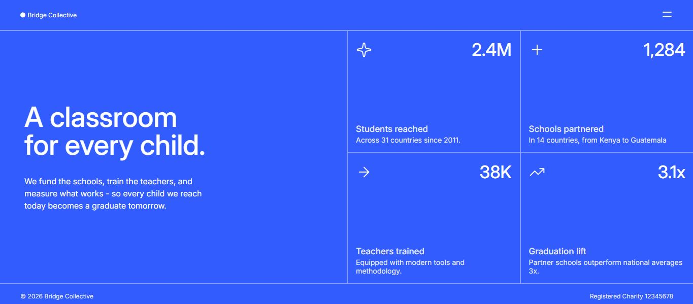
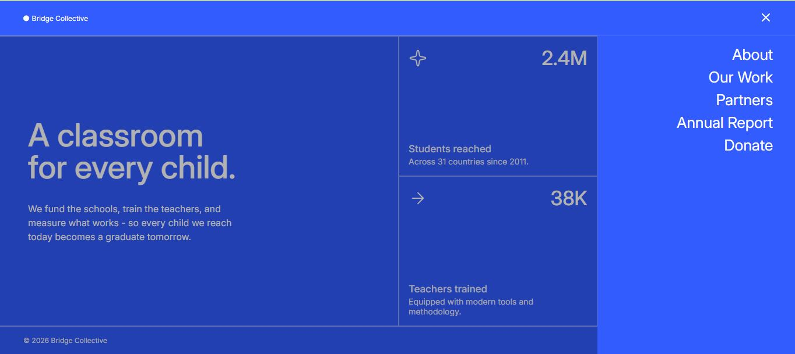
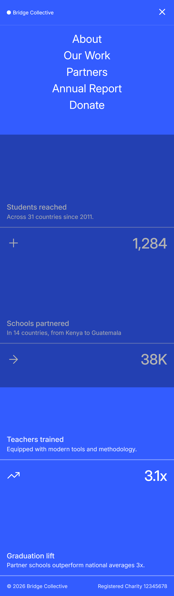

# Frontend Mentor - Grid Landing Page

This is my solution to the [Grid Landing Page](https://www.frontendmentor.io/challenges/grid-landing-page) challenge on Frontend Mentor.

## Overview

### The Challenge

The goal was to build a responsive landing page that closely matches the provided design across desktop and mobile screen sizes.

The page includes:

- A responsive header with a menu button
- A navigation menu with an overlay
- A main introduction section
- Four statistics cards
- A responsive desktop and mobile layout
- Interactive menu behaviour using JavaScript

## Links

- [GitHub Repository](https://github.com/Kananpretty/Frontend-Mentor-Challenges/tree/main/Challenge-10-Grid-Landing-page)
- [Live Demo](https://grid-landing-page-seven.vercel.app/)

## Screenshot






## Built With

- Semantic HTML5
- CSS3
- CSS Grid
- CSS Flexbox
- Responsive design
- CSS custom properties
- HSL and HSLA colors
- Custom fonts with `@font-face`
- JavaScript DOM manipulation
- Responsive JavaScript using `window.innerWidth`
- `offsetHeight` for measuring dynamic element heights

## What I Learned

### Responsive Layouts

This challenge helped me move beyond individual cards and work with a complete responsive page layout.

I used CSS Grid for the desktop layout and changed the structure to Flexbox on smaller screens.

### CSS Grid and Flexbox

I practised deciding when to use Grid versus Flexbox rather than relying on one layout method for everything.

The desktop statistics section uses a two-column Grid, while the mobile version stacks the statistics vertically.

### Dynamic Heights with JavaScript

One of the more interesting parts of this challenge was handling the responsive navigation menu.

The header height is not hardcoded. JavaScript measures the actual rendered height using:

```js
header.offsetHeight;
```

and stores it in a CSS custom property:

```css
--header-height
```

The same approach is used for the mobile statistics header:

```css
--stats-header-height
```

This allows the fixed navigation menu to position and size itself based on the actual rendered content.

### DOM Manipulation

I practised using:

- `querySelector()`
- `classList.toggle()`
- `classList.contains()`
- `setAttribute()`
- Updating an image's `src`

The menu button changes between the menu and close icons depending on whether the navigation is open.

### Accessibility

I used:

- Semantic elements such as `<header>`, `<main>`, `<section>`, `<nav>` and `<footer>`
- An accessible label for the menu button
- An empty `alt=""` attribute for decorative icons
- The entire statistic card as an anchor because the cards represent clickable sections

## Challenges I Encountered

The biggest challenge was getting the mobile layout and navigation menu to behave correctly when the content height changes.

I initially tried solving the layout using fixed and inherited heights, but this highlighted the difference between:

- The viewport height
- The available Grid height
- The content's natural height
- The height of individual cards

I eventually used the natural content height and JavaScript measurements only where CSS needed the actual rendered height.

Another challenge was making sure the mobile navigation menu was positioned relative to the actual header height instead of using a hardcoded value.

Working through these problems helped me understand when JavaScript is useful for communicating dynamic measurements to CSS, rather than using JavaScript to control the entire layout.

## What I'm Proud Of

I'm particularly proud of moving from building individual UI cards to building an entire responsive page.

This challenge required me to think about:

- Page-level layout
- Responsive breakpoints
- Component-like sections
- Navigation states
- Overlays
- Dynamic sizing
- Accessibility
- JavaScript interaction

It felt like a step up from the earlier card-based challenges because I had to think about how multiple sections interact with each other rather than styling one isolated component.

## What I Would Improve

If I revisited this project, I would:

- Refine the responsive breakpoints based on more viewport sizes
- Improve the mobile navigation transition
- Review whether some of the JavaScript height calculations could be replaced with a pure CSS solution
- Add more keyboard-accessibility considerations to the navigation
- Add focus states for interactive elements

## Continued Development

My next focus areas are:

- More complex responsive layouts
- CSS Grid
- CSS Flexbox
- JavaScript interactions
- Accessibility
- More advanced Frontend Mentor challenges

## Author

**Kanan Mehta**

- GitHub - [@Kananpretty](https://github.com/Kananpretty)
