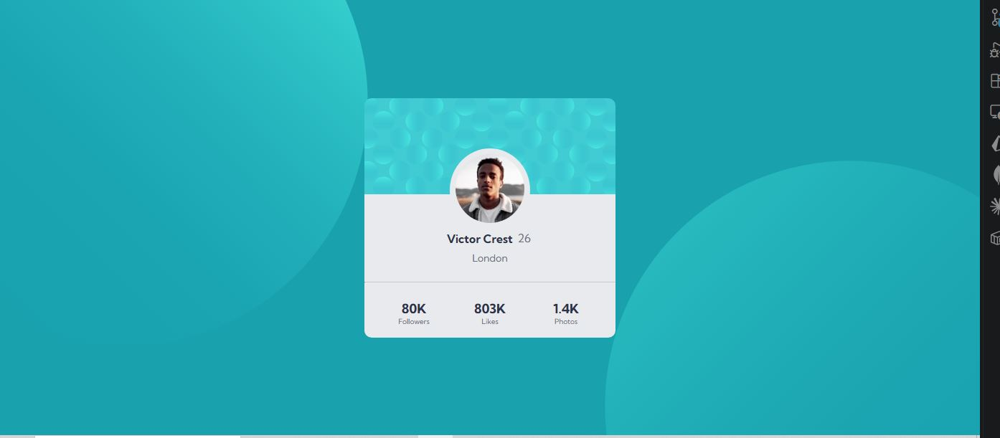

# Frontend Mentor - Profile Card Component

This is my solution to the [Profile Card Component](https://www.frontendmentor.io/challenges/profile-card-component-cfArpWshJ) challenge on Frontend Mentor.

## Overview

### The Challenge

The goal was to build a profile card component and make it look as close to the provided design as possible across different screen sizes.

The component includes:

- A decorative background
- A profile image
- Profile information
- Location information
- Social statistics

### Links

- [Github](https://github.com/Kananpretty/Frontend-Mentor-Challenges/tree/main/Challenge-11-Profile-card-component)
- [Live Demo](https://profile-card-component-topaz-nine.vercel.app/)

### Screenshot



## Built With

- Semantic HTML5
- CSS3
- CSS Flexbox
- CSS Grid
- Responsive design
- CSS background images
- HSL and HSLA colors

## What I Learned

This challenge helped me practise and strengthen my understanding of:

### CSS Layout

- Using Flexbox to center a component both vertically and horizontally
- Using Flexbox to control the internal layout of the profile card
- Using CSS Grid to create the three-column social statistics section
- Understanding how elements can overlap visually while still remaining within the normal document flow
- Using spacing and layout relationships instead of relying on unnecessary absolute positioning

### Background Images

One of the more interesting parts of this challenge was working with the decorative background images.

I used multiple background images on the page and positioned them independently:

- One background image positioned toward the top
- Another positioned toward the bottom
- Different positioning values for smaller screen sizes

This helped me understand how multiple CSS background layers can be combined without adding extra HTML elements purely for decoration.

### Responsive Design

The card itself remains structurally consistent across different screen sizes while the surrounding background positioning adapts for smaller viewports.

This reinforced the idea of keeping the HTML structure simple and allowing CSS to control how the design responds to different viewport sizes.

### Normal Document Flow

A useful learning from this challenge was understanding that elements that visually appear to overlap do not always require `position: absolute`.

By thinking about the natural height of the content and how margins and spacing affect the document flow, I was able to achieve the required layout while keeping the elements in the normal flow.

This helped reinforce an important CSS principle:

> Use positioning when an element actually needs to be positioned independently, rather than using it simply to make a design look visually correct.

## CSS Structure

The profile card is divided into logical sections:

```text
Profile Card
├── Profile Image
├── Profile Information
│   ├── Name
│   └── Location
└── Social Statistics
    ├── Followers
    ├── Likes
    └── Photos
```

Flexbox is used for the overall component and internal vertical layout, while CSS Grid is used for the three-column statistics section.

This helped me practise choosing the layout system based on the relationship between elements rather than using Grid or Flexbox everywhere.

## Responsive Layout

The desktop layout keeps the profile card centered within the viewport:

```text
┌──────────────────────────────────┐
│                                  │
│          ┌────────────┐          │
│          │  Profile   │          │
│          │    Card    │          │
│          │            │          │
│          │   Profile  │          │
│          │ Information│          │
│          │            │          │
│          │────────────│          │
│          │ Followers  │          │
│          │ Likes      │          │
│          │ Photos     │          │
│          └────────────┘          │
│                                  │
└──────────────────────────────────┘
```

The card remains responsive while the decorative background images use different positioning on smaller screens.

The HTML structure remains unchanged, with CSS controlling the presentation across viewport sizes.

## Continued Development

For future challenges, I want to continue improving:

- Semantic HTML and accessibility
- Responsive layout techniques
- CSS Grid and Flexbox
- Precise spacing and sizing
- Typography and visual hierarchy
- CSS background positioning
- Hover and focus states
- Writing simpler and more maintainable CSS
- Understanding layout relationships instead of relying on positioning hacks
- Choosing between Flexbox and Grid based on the actual layout requirements

## Author

**Kanan Mehta**

- GitHub - [@Kananpretty](https://github.com/Kananpretty)
