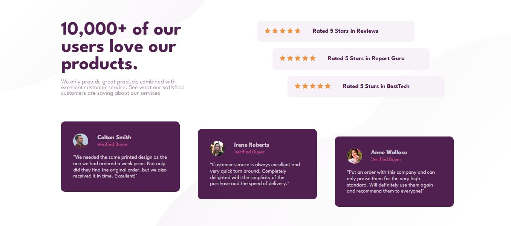
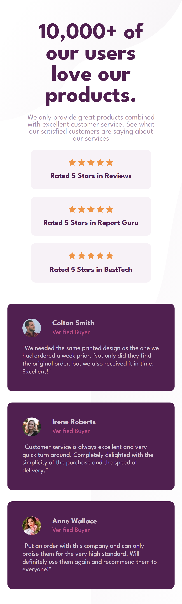

# Frontend Mentor - Social Proof Section

This is my solution to the [Social Proof Section](https://www.frontendmentor.io/challenges/social-proof-section-6e0qTv_bA) challenge on Frontend Mentor.

## Overview

### The Challenge

The goal was to build a responsive social proof section that closely matches the provided design across different screen sizes.

The page features:

- Customer ratings
- Star ratings
- Testimonials
- Verified buyer information
- Decorative background patterns
- Responsive desktop and mobile layouts

The desktop design uses staggered positioning for the ratings and testimonial cards, while the mobile design presents the content in a natural stacked layout.

### Links

- [Live Demo](https://social-proof-section-ivory-eight.vercel.app/)
- [Github](https://github.com/Kananpretty/Frontend-Mentor-Challenges/tree/main/Challenge-12-Social-Proof-Section)

### Screenshot




## My Process

I started by building the semantic HTML structure for the page and then used CSS Grid and Flexbox to recreate the different sections of the design.

For the staggered rating and testimonial cards, I initially considered using individual `:nth-child()` selectors to apply different offsets to each element.

Since the offsets follow a predictable pattern based on the position of each element, I explored a more scalable CSS approach and used the modern `sibling-index()` function to calculate the offsets dynamically.

For mobile, I treated the layout as a separate responsive composition rather than simply shrinking the desktop version. The grid-based desktop layout changes to stacked Flexbox layouts, and the desktop staggered offsets are removed so the content flows naturally.

## Built With

- Semantic HTML5
- CSS3
- CSS Grid
- CSS Flexbox
- Responsive design
- CSS `sibling-index()`
- CSS custom properties
- Google Fonts — League Spartan

## What I Learned

### Using `sibling-index()` for Repeated Patterns

One of the main things I explored in this challenge was using the CSS `sibling-index()` function to create predictable staggered layouts.

Instead of manually defining an offset for every item with selectors such as `:nth-child()`, I used the element's position among its siblings:

```css
margin-left: calc((sibling-index() - 1) * 40px);
```

and:

```css
margin-top: calc((sibling-index() - 1) * 20px);
```

This allows the offset to be calculated automatically based on the position of each element.

It was a useful exercise in thinking about how modern CSS features can reduce repetitive styles and make a layout more scalable.

### Responsive Layout Decisions

This challenge reinforced the idea that responsive design is not always about simply shrinking a desktop layout.

The desktop version uses:

- CSS Grid for the main two-column composition
- A three-column Grid for the testimonial cards
- Calculated offsets to create the staggered positioning

The mobile version changes to:

- A single-column layout
- Flexbox for vertically stacked content
- Natural document flow
- No staggered offsets

This allowed the mobile layout to remain clean and readable instead of trying to preserve a desktop-specific visual treatment at smaller widths.

### Choosing Layout Tools Intentionally

I continued practising when to use CSS Grid versus Flexbox based on the relationship between elements.

Grid was useful for layouts where elements needed to be arranged in columns and rows, while Flexbox was useful for arranging content within individual sections and creating the stacked mobile layout.

### Modern CSS Features

This challenge also gave me an opportunity to explore a newer CSS feature rather than solving the problem using only familiar techniques.

It helped me think about the trade-off between using a modern CSS feature for a cleaner implementation and considering browser support before using it in a production project.

## Responsive Layout

The desktop layout uses a two-column composition for the introductory content and ratings:

```text
┌─────────────────────────────────────────────┐
│                                             │
│  Social Proof        ★★★★★ Rating          │
│  Introduction        ★★★★★ Rating          │
│                      ★★★★★ Rating          │
│                                             │
│  ┌──────────┐ ┌──────────┐ ┌──────────┐    │
│  │ Testimonial│ │Testimonial│ │Testimonial│ │
│  └──────────┘ └──────────┘ └──────────┘    │
│                                             │
└─────────────────────────────────────────────┘
```

The testimonial cards are intentionally staggered on desktop.

On smaller screens, the layout changes to a single column:

```text
┌──────────────────┐
│ Social Proof     │
│ Introduction     │
├──────────────────┤
│ Rating           │
├──────────────────┤
│ Rating           │
├──────────────────┤
│ Rating           │
├──────────────────┤
│ Testimonial      │
├──────────────────┤
│ Testimonial      │
├──────────────────┤
│ Testimonial      │
└──────────────────┘
```

The desktop-specific offsets are removed on mobile so the content follows the natural document flow.

## Continued Development

For future challenges, I want to continue improving:

- Responsive layout techniques
- CSS Grid and Flexbox
- Modern CSS features
- Browser compatibility and progressive enhancement
- Semantic HTML and accessibility
- Precise spacing and typography
- Writing simpler and more maintainable CSS
- Understanding layout relationships instead of relying on positioning hacks

## Author

**Kanan Mehta**

- GitHub — [@Kananpretty](https://github.com/Kananpretty)
- Frontend Mentor — [@Kananpretty](https://www.frontendmentor.io/profile/Kananpretty)
