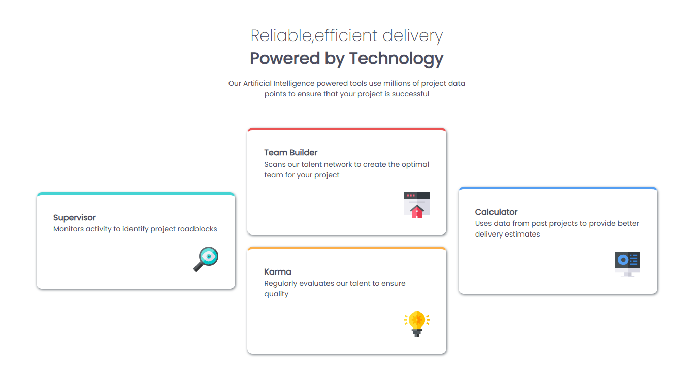

# Frontend Mentor - Four Card Feature Section

This is my solution to the [Four Card Feature Section](https://www.frontendmentor.io/challenges/four-card-feature-section-weK1eFYK) challenge on Frontend Mentor.

## Overview

### The Challenge

The goal was to build a responsive four-card feature section that closely matches the provided design across different screen sizes.

The page features:

- Four feature cards
- A three-column desktop layout
- Two cards stacked within the center column
- A single-column mobile layout
- Responsive typography and spacing

### Screenshot



### Links

- [Live Demo](https://four-card-feature-theta.vercel.app/)
- [Github](https://github.com/Kananpretty/Frontend-Mentor-Challenges/tree/main/Challenge-13-Four-Card-Feature)

## My Process

I started by building the semantic HTML structure and then used CSS Grid to create the overall three-column desktop layout.

The first and last cards occupy the outer columns, while the two middle cards are grouped together and stacked vertically using Flexbox.

For the mobile layout, I changed the main card container from Grid to Flexbox and stacked all four cards vertically. I also adjusted the header width and spacing to work better with the smaller viewport.

## Built With

- Semantic HTML5
- CSS3
- CSS Grid
- CSS Flexbox
- Responsive design
- Media queries
- Google Fonts — Poppins

## What I Learned

### Combining Grid and Flexbox

This challenge helped me practise using different layout systems together rather than trying to solve the entire page with one technique.

I used CSS Grid for the overall three-column desktop arrangement and Flexbox for the two cards that need to be stacked within the middle column.

This reinforced the idea that Grid and Flexbox can complement each other, with each layout system handling the relationship it is best suited for.

### Responsive Layout Transformation

On mobile, the desktop three-column structure no longer makes sense, so I changed the card container to a single-column Flexbox layout.

This reinforced an important responsive design concept:

> Responsive design isn't always about shrinking a desktop layout. Sometimes the layout structure itself needs to change at different viewport sizes.

The HTML structure remains the same while CSS controls how the cards are arranged.

### Using Spans Inside a Heading

I used separate `<span>` elements inside the `<h1>` so that the two parts of the heading could be styled independently while remaining part of the same semantic heading.

This allowed me to control the typography without splitting the heading into separate elements that would have different semantic meaning.

### Thinking About Layout Relationships

This challenge gave me more practice thinking about how elements relate to each other rather than positioning individual cards manually.

The desktop arrangement can be described as:

```text
┌──────────────┬──────────────┬──────────────┐
│              │   Card 2     │              │
│   Card 1     ├──────────────┤   Card 4     │
│              │   Card 3     │              │
└──────────────┴──────────────┴──────────────┘
```

Instead of positioning each card independently, I used the structure of the layout to determine where each group belongs.

## Responsive Layout

The desktop version uses CSS Grid for the three-column arrangement:

```text
┌──────────────┬──────────────┬──────────────┐
│   Supervisor │              │    Builder   │
│              │              │              │
│              │   Team       │              │
│              │   Karma      │              │
│              │              │              │
│              │              │              │
│              │              │   Calculator │
└──────────────┴──────────────┴──────────────┘
```

The middle column uses Flexbox to stack its two cards.

On smaller screens, the layout changes to a single column:

```text
┌──────────────────┐
│   Supervisor     │
├──────────────────┤
│   Team Builder   │
├──────────────────┤
│   Karma          │
├──────────────────┤
│   Calculator     │
└──────────────────┘
```

This keeps the content readable and allows each card to use the full available width.

## Continued Development

For future challenges, I want to continue improving:

- Semantic HTML and accessibility
- CSS Grid and Flexbox
- Responsive layout techniques
- Choosing the appropriate layout system for each design
- Responsive typography and spacing
- Testing layouts across a wider range of viewport sizes
- Writing simpler and more maintainable CSS
- Understanding layout relationships instead of relying on positioning hacks

## Author

**Kanan Mehta**

- GitHub — [Kananpretty](https://github.com/Kananpretty)
- Frontend Mentor — [Kananpretty](https://www.frontendmentor.io/profile/Kananpretty)
