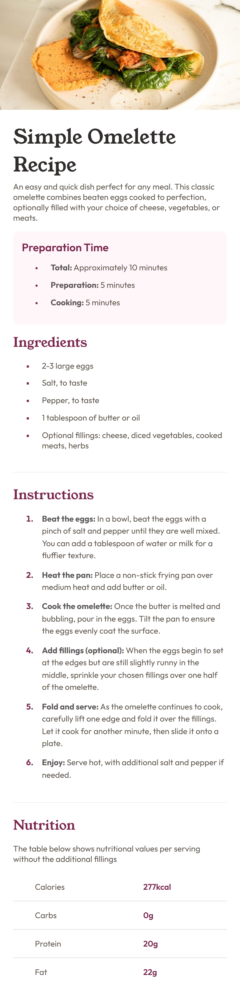
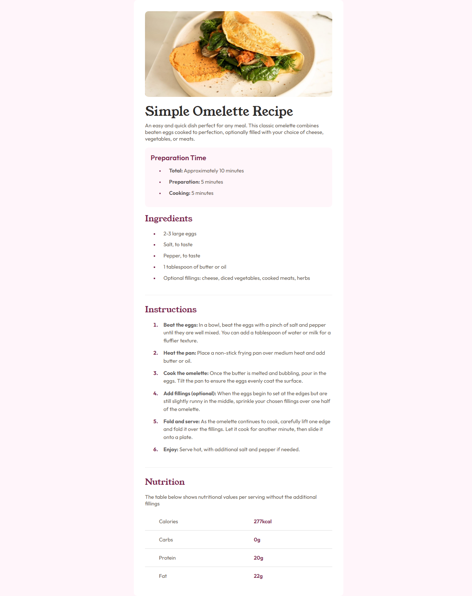

# Frontend Mentor - Recipe Page

This is my solution to the [Recipe Page](https://www.frontendmentor.io/challenges/recipe-page-KiTsR8QQKm) challenge on Frontend Mentor.

## Overview

### The Challenge

The goal was to build a responsive recipe page that closely matches the provided design across different screen sizes.

The page includes:

- Recipe information and description
- Preparation and cooking times
- Ingredients and instructions
- Nutrition information
- Responsive typography and spacing
- A responsive desktop and mobile layout

### Links

- [Live Demo](https://recipe-page-virid-nu.vercel.app/)
- [Github](https://github.com/Kananpretty/Frontend-Mentor-Challenges/tree/main/Challenge-14-Recipe-Page)

### Screenshot




## My Process

I started by building the page using semantic HTML, structuring the content into meaningful sections for the recipe information, ingredients, instructions, and nutrition data.

For the styling, I focused on typography, spacing, list styling, table styling, and the overall relationship between the different sections.

I used Flexbox to manage the spacing between the major sections and worked with the existing HTML structure rather than introducing additional wrapper elements purely for layout purposes.

For the responsive layout, the desktop version uses a centered recipe card while the mobile version adapts to the smaller viewport by removing the card-style treatment and allowing the content to use the full available width.

## Built With

- Semantic HTML5
- CSS3
- Flexbox
- Responsive design
- Custom fonts with `@font-face`
- Variable fonts
- CSS pseudo-elements (`::marker`)
- HTML tables
- Media queries

## What I Learned

### Semantic HTML

This challenge gave me more practice structuring content using semantic HTML elements such as:

- `<article>`
- `<section>`
- `<h1>`
- `<h2>`
- `<ul>`
- `<ol>`
- `<table>`

I also used `<th scope="row">` for the nutrition labels so that the table has clearer semantic relationships between its row headers and values.

### Working With Local and Variable Fonts

I worked with local font files using `@font-face`, including a variable font.

This helped reinforce how font files are declared in CSS and how a variable font can provide a range of font weights through a single font file.

### Styling List Markers

I practised using the `::marker` pseudo-element to customise the appearance of list markers.

This was useful for understanding that list markers can be styled directly without needing additional HTML elements around the list items.

### Spacing With Flexbox

I used Flexbox with `gap` to create consistent spacing between the major sections of the recipe.

For areas where the design required a slightly different relationship between elements, I made an intentional spacing adjustment rather than introducing an unnecessary wrapper element purely to control the layout.

This helped reinforce the idea that spacing should come from the existing layout structure whenever possible.

### Styling HTML Tables

The nutrition section gave me an opportunity to practise styling a native HTML table.

I worked with:

- Table row borders
- Cell padding
- Row headers
- Typography differences between labels and values
- Consistent column alignment

This was useful practice because tables have their own layout behaviour and require a slightly different approach from Flexbox or Grid layouts.

## Responsive Layout

The desktop version uses a centered recipe card with a constrained content width:

```text
┌──────────────────────────────────┐
│                                  │
│        Recipe Image              │
│                                  │
│        Recipe Title              │
│        Description               │
│                                  │
│        Preparation Time          │
│                                  │
│        Ingredients               │
│        Instructions              │
│        Nutrition                 │
│                                  │
└──────────────────────────────────┘
```

On smaller screens, the card-style layout changes so that the content uses the available viewport width more naturally:

```text
┌──────────────────────┐
│ Recipe Image         │
├──────────────────────┤
│ Recipe Title         │
│ Description          │
│                      │
│ Preparation Time     │
│                      │
│ Ingredients          │
│ Instructions         │
│ Nutrition            │
└──────────────────────┘
```

The HTML structure remains the same while CSS controls how the layout adapts between desktop and mobile.

## Challenges I Encountered

One of the main challenges was matching the spacing between the different sections while keeping the CSS simple and maintainable.

I used a consistent `gap` on the main content container and then adjusted specific relationships where the design required different spacing.

The nutrition section was another useful challenge because it required styling a native HTML table while maintaining the correct semantic structure.

I also had to make decisions about responsive spacing and sizing rather than simply scaling the desktop layout down for smaller screens.

## What I Am Most Proud Of

I am most proud of the semantic HTML structure and the way the page is organised without relying on unnecessary wrapper elements.

I am also happy with how I handled spacing. Instead of introducing additional elements purely for visual spacing, I used the existing document structure and CSS layout properties intentionally.

This challenge also gave me more confidence with some of the smaller CSS details that are easy to overlook, such as list markers, table styling, font loading, and responsive spacing.

## What I Would Do Differently Next Time

I would spend more time comparing the final spacing and typography against the reference design, particularly at smaller viewport sizes.

I would also continue practising responsive CSS so that choosing breakpoints and deciding which properties should change at each breakpoint becomes more intuitive.

## Continued Development

For future challenges, I want to continue improving:

- Semantic HTML and accessibility
- Responsive layout techniques
- CSS spacing and sizing
- Typography and font handling
- CSS Grid and Flexbox
- Lists and table styling
- Choosing appropriate breakpoints
- Pixel accuracy
- Writing simple and maintainable CSS
- Understanding layout relationships rather than relying on positioning hacks

## Areas I Would Like Feedback On

I would appreciate feedback on:

- Semantic HTML structure
- Responsive layout decisions
- CSS spacing and typography
- Table styling
- List styling
- Whether my CSS structure is maintainable and scalable
- Overall pixel accuracy and responsive behaviour

## Author

**Kanan Mehta**

- GitHub — [Kananpretty](https://github.com/Kananpretty)
