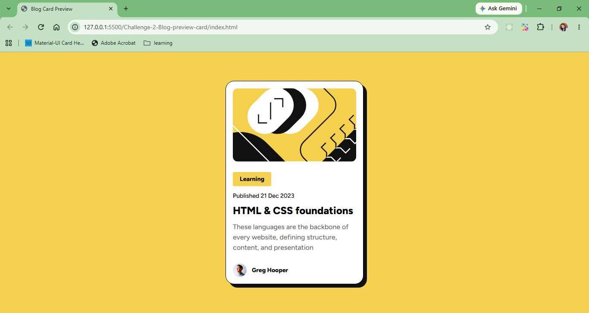

# Frontend Mentor - Blog Preview Card

This is my solution to the [Blog Preview Card challenge](https://www.frontendmentor.io/challenges/blog-preview-card-ckPaj01IcS).

## Overview

### The challenge

The goal was to build a blog preview card as closely as possible to the provided design.

Users should be able to:

- View the blog preview card on different screen sizes
- See the article category, publication date, title, and description
- View the author's avatar and name
- Experience the hover state on interactive elements

### Screenshot

## Built with

- Semantic HTML5
- CSS
- Flexbox
- Responsive design
- Google Fonts
- CSS box model
- CSS box-shadow

## What I learned

This challenge helped me refresh and practice:

- Using semantic HTML elements appropriately
- Using `<article>` for self-contained content
- Using `<time>` with the `datetime` attribute for publication dates
- Understanding the difference between semantic elements and generic `
` elements
- Working with typography, spacing, and line-height
- Creating a responsive card layout
- Using CSS `box-shadow` to create an offset shadow
- Using `border-radius` and borders to match a design
- Understanding the CSS box model

### Semantic HTML

The card uses semantic HTML to describe the content structure:

- `<main>` for the primary page content
- `<article>` for the self-contained blog preview
- `<section>` for the article content grouping
- `<time>` for the publication date
- `<h1>` for the article title
- `
` for the article description
- `<footer>` for the author information

## Continued development

For future challenges, I want to continue improving:

- Semantic HTML and accessibility
- Responsive design
- Flexbox and CSS Grid
- Typography and spacing systems
- Interactive states
- Writing clean and maintainable CSS

## Author

Kanan Mehta
