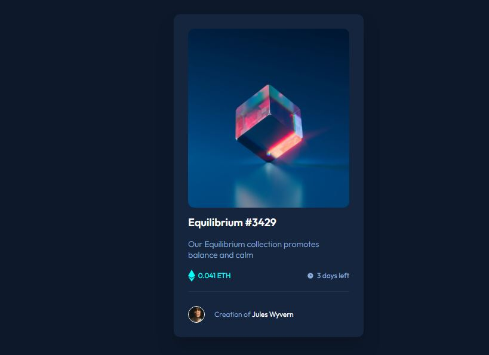
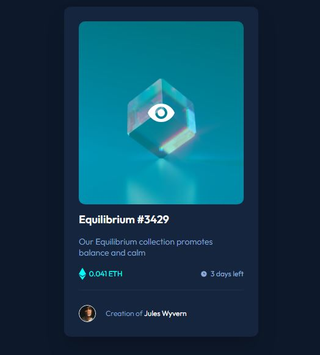

# NFT Preview Card

This is my solution to the **NFT Preview Card Component** challenge on Frontend Mentor.

## Overview

The challenge was to build an NFT preview card that displays an NFT image, title, description, price, remaining time, and creator information.

The card also includes interactive hover states for the NFT image, title, and creator name.

One of the main learning goals of this challenge was understanding how to layer elements on top of an image to create an interactive hover overlay.

## Screenshot





## Built With

- Semantic HTML5
- CSS
- Flexbox
- CSS positioning
- HSL and HSLA colors
- Hover states
- CSS transitions
- Google Fonts

## What I Learned

While building this challenge, I practiced and learned:

- Using Flexbox to structure and align the content inside the card
- Using nested Flexbox layouts for the price and time information
- Using `position: relative` to create a positioning context
- Using `position: absolute` to layer one element on top of another
- Creating an image hover overlay
- Using `opacity` to hide and show the overlay
- Triggering changes in a child element when hovering over its parent
- Using `z-index` to control element layering
- Using `overflow: hidden` with `border-radius` to prevent the overlay from extending outside the image
- Using `object-fit: cover` to control image sizing
- Using `transition` to make hover effects smoother
- Using HSL and HSLA colors for backgrounds and transparency
- Building hover states for interactive elements
- Using `gap` to manage spacing between Flexbox items
- Using semantic HTML to structure card content

## Image Hover Interaction

The NFT image includes a hover interaction where a transparent cyan overlay appears on top of the image along with a view icon.

The structure used for this interaction is:

```text
NFT image container
│
├── NFT image
│
└── NFT image overlay
    │
    └── View icon
```
