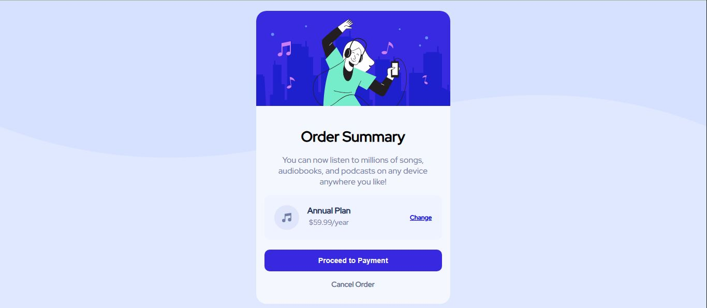

# Frontend Mentor - Order Summary Component

This is my solution to the [Order Summary Component challenge](https://www.frontendmentor.io/challenges/order-summary-component-QlPmajDUj) from Frontend Mentor.

## Overview

A responsive order summary card for a fictional music subscription service.

The component includes:

- Hero illustration
- Order summary information
- Annual plan details
- Change plan link
- Proceed to Payment button
- Cancel Order link
- Responsive desktop and mobile backgrounds
- Hover and keyboard focus states

## Links

- **[GitHub Repository] In Progress**
- **[Live Demo]In Progress**

## Screenshot



## Built With

- Semantic HTML5
- CSS3
- Flexbox
- Responsive design
- CSS media queries
- Multiple CSS backgrounds
- HSL/HSLA colors
- Google Fonts
- Hover and focus-visible states

## What I Learned

### Multiple Background Layers

This challenge helped me understand how multiple CSS background layers can be combined with a background color.

```css
body {
  background:
    url("./images/pattern-background-desktop.svg") top center / 100% 50%
      no-repeat,
    hsl(225, 100%, 94%);
}
```

The background image is used as a decorative layer while the HSL color provides the base page background.

I also learned that different background images can be swapped at a breakpoint without adding extra HTML elements.

### Responsive Component Sizing

Instead of relying on a fixed width, the card can use a fluid width with a maximum width:

```css
.order-summary-card {
  width: 100%;
  max-width: 375px;
}
```

This allows the component to shrink on smaller screens while maintaining the intended maximum width on larger screens.

### Flexbox

I used Flexbox to structure the plan information and action buttons.

The plan section uses nested Flexbox layouts to keep the music icon, plan details, and Change link aligned correctly.

### Interactive States

I added hover states for the interactive elements and considered keyboard accessibility through `:focus-visible`.

This reinforced the difference between designing only for mouse interaction and providing visible interaction states for keyboard users as well.

## Semantic HTML

The component uses semantic elements based on their purpose:

- `<main>` for the primary page content
- `<article>` for the self-contained order summary component
- `<h1>` for the main heading
- `<p>` for descriptive and plan information
- `<a>` for the Change and Cancel Order links
- `<button>` for the Proceed to Payment action
- Decorative images use empty `alt` attributes

## CSS & Responsive Design

The layout was built without a CSS framework.

Key techniques used:

- Flexbox for component layout
- `max-width` and `width: 100%` for responsive sizing
- Multiple background layers
- Separate desktop and mobile background assets
- Border radius for the card and hero image
- HSL/HSLA color values
- CSS hover states
- Keyboard focus states
- Media queries only where the design actually changes

## Continued Development

For future projects, I want to continue improving:

- Pixel-perfect implementation
- Responsive layouts across a wider range of viewport sizes
- Accessible interaction states
- CSS architecture and maintainability
- Understanding when responsive behavior can be achieved without additional breakpoints

## Author

**Kanan Mehta**

- Frontend Mentor: [@Kananpretty](https://www.frontendmentor.io/profile/Kananpretty)
- GitHub: https://github.com/Kananpretty
